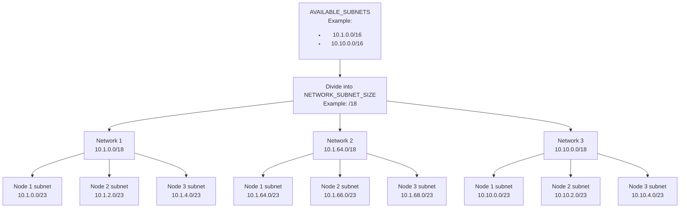
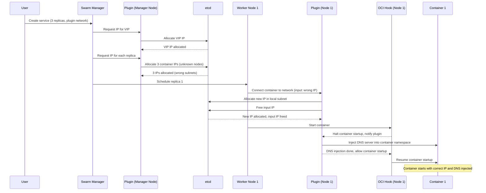
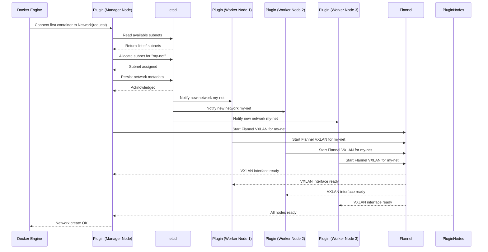
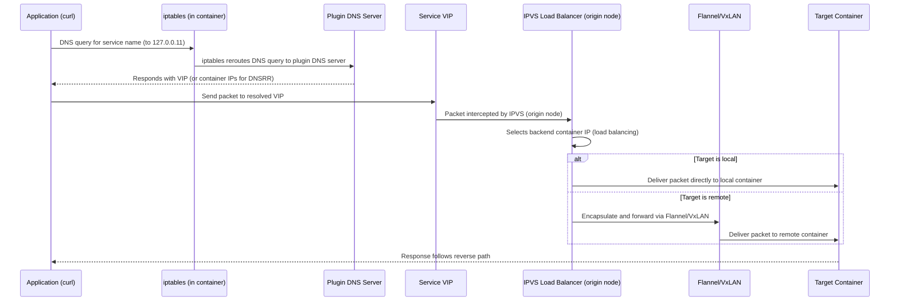

# Introduction

This plugin is a complete replacement of the Docker swarm overlay network. It fully supports DNS
resolution for Docker Swarm services, both DNSRR and VIP. It also supports DNS resolution for
containers.  
It supports more than the recommended 255 containers for an overlay network.

# Motivation
Or: Why would you write a new Docker Swarm networking plugin?!?

The Docker Swarm overlay networks [are](https://github.com/moby/moby/issues/49908) [quite](https://github.com/moby/moby/issues/47728) [buggy](https://gist.github.com/dhilgarth/1d2c350ddb1204ae07640471b4f2a732) [and](https://github.com/moby/moby/issues/49555) [crumble](https://github.com/moby/moby/issues/50232) under certain conditions.  

While working on setting up a highly available infrastructure based on Docker Swarm for a client, the network sometimes would become unreliable. Network packages would be sent to the wrong server or to the right server but would never reach the container. Or a bunch of other issues.  

The initial idea of solving these issues was [this service](https://github.com/sovarto/swarm-network-fixer): It analyzes the NetworkDB of Docker Swarm on each node and verifies that all entries are correct. If not, it fixes the entries in the NetworkDB.  
Unfortunately, changing the entries in the NetworkDB does not cause Docker Swarm to update the underlying Linux Networking services like FDB, APR, IPVS or VxLAN interfaces.  
This service still has merit as a tool to detect *some* of the problems that Docker Swarm Overlay networks have today.

Reliability problems with the networking have been reported for years, but only the analysis by [Martin](https://github.com/s4ke) and [myself](https://github.com/dhilgarth) has actually provided enough details - even [a reproduction](https://github.com/dhilgarth/swarm-overlay-network-breaker) for a subset of the issues - for it to be taken seriously by engineers at Mirantis and they are now working on fixing those issues.

However, when I decided to implement this plugin, it wasn't yet clear if they would work on it at all and when it would be fixed.  

The aforementioned issues were the reason why I looked into other networking solutions for Docker Swarm. Simple solutions like using plain Flannel were discarded, because they didn't integrate with the networks configured in Docker Swarm. Alternative networking plugins like [Weave](https://rajch.github.io/weave/) don't support resolving Docker Swarm Services that use the default endpoint mode "VIP".

With no option left, I decided to implement my own.


# Control plane vs. data plane

With regards to the actual network traffic, this plugin is just the control plane. The data plane is
standard Linux VxLAN, administered by Flannel.  
With regards to the Service VIPs, this plugin is also just the control plane. The data plane is
standard Linux IPVS and iptables.  
With regards to the DNS resolution of services and containers, this plugin is the data plane: Very
similar to what Docker does, this plugin runs a DNS server per container and injects it into the
container, completely replacing the standard Docker DNS.

Normal Docker Swarm Overlay networks can co-exist with networks managed by this plugin. However, if a container is in both, a normal overlay network and a network managed by this plugin, DNS resolution is performed by the DNS server provided by this plugin, even for containers that are only reachable through the normal overlay network.

# Setup

## Install etcd

The plugin needs etcd to store its state.  
Running etcd as a normal docker swarm service inside the same cluster will lead to issues when the
node is restarted, because the network plugin will fail to start and become disabled if it can't
reach etcd.

Instead, run etcd either outside of the cluster, or run it as a normal Linux service on some of the
nodes of the cluster.

## Install the plugin

On each node, install the plugin:

```
docker plugin install --alias flannel-np:1.0.0 --disable --grant-all-permissions sovarto/docker-network-plugin-flannel
docker plugin set flannel-np:1.0.0 ETCD_PREFIX=/flannel/',
docker plugin set flannel-np:1.0.0 ETCD_ENDPOINTS=172.16.0.2:2379,172.16.0.3:2379,172.16.0.4:2379',
docker plugin set flannel-np:1.0.0 DEFAULT_FLANNEL_OPTIONS="-iface=enp7s0"',
docker plugin set flannel-np:1.0.0 AVAILABLE_SUBNETS=10.1.0.0/16,10.10.0.0/16,10.20.0.0/16,10.30.0.0/16,10.50.0.0/16',
docker plugin set flannel-np:1.0.0 NETWORK_SUBNET_SIZE=18',
docker plugin set flannel-np:1.0.0 DEFAULT_HOST_SUBNET_SIZE=23',
docker plugin set flannel-np:1.0.0 IS_HOOK_AVAILABLE=true',
docker plugin set flannel-np:1.0.0 DNS_DOCKER_COMPATIBILITY_MODE=false',
docker plugin enable flannel-np:1.0.0'

```

Adjust the configuration options to match your setup.
Especially, set `ETCD_ENDPOINTS` to the proper configuration of your etcd setup.  
Set `DEFAULT_FLANNEL_OPTIONS` to use the network interface that connects the swarm nodes.  
Adjust `AVAILABLE_SUBNETS`, `NETWORK_SUBNET_SIZE` and `DEFAULT_HOST_SUBNET_SIZE` to your needs.
Set `IS_HOOK_AVAILABLE` to `false` if you don't install the hook (see next section)

| Name                          | Description                                                                                                                                                                                                                                |
|-------------------------------|--------------------------------------------------------------------------------------------------------------------------------------------------------------------------------------------------------------------------------------------|
| ETCD_PREFIX                   | The prefix for all state inside etcd. Usually can be left as is                                                                                                                                                                            |
| ETCD_ENDPOINTS                | The etcd endpoints the plugin should use                                                                                                                                                                                                   |
| DEFAULT_FLANNEL_OPTIONS       | This supports all Flannel options, but -iface is needed and needs to be set to the network interface name that connects the swarm nodes.                                                                                                   |
| AVAILABLE_SUBNETS             | These are the subnets that are available for Flannel. Their size needs to be at least as big as `NETWORK_SUBNET_SIZE`. This setting along with `NETWORK_SUBNET_SIZE` determines the total number of supported networks.                    |
| NETWORK_SUBNET_SIZE           | The size of the subnet from which each node will choose its subnet. The relationship between this setting and `DEFAULT_HOST_SUBNET_SIZE` determines the number of supported nodes in the cluster.                                          |
| DEFAULT_HOST_SUBNET_SIZE      | The default size of the subnet each host reserves for the IP addresses on itself for a particular network. This size determines the number of IP addresses per node, and thus, the number of containers + services the network can support |
| IS_HOOK_AVAILABLE             | Whether our hook is available or not (see next section)                                                                                                                                                                                    |
| DNS_DOCKER_COMPATIBILITY_MODE | The default docker DNS has [some quirks](https://github.com/sovarto/docker-network-plugin-flannel/blob/main/plugin/pkg/dns/resolver.go#L46) when resolving names. Set to true if, for some reason, you depend on them.                              |

## Install hook (optional but strongly recommended)

The docker networking plugin API is quite lacking in terms of flexibility. It doesn't support the
use case of each node having its own subnet. To still support proper DNS resolution, especially for
service VIPs, we run our own DNS server per container, as mentioned above. To properly inject it
into the container, we need the OCI runtime hook `createContainer` which isn't supported by a
standard docker setup.

To fix this, use [oci-add-hooks](https://github.com/sovarto/oci-add-hooks/). Download the released
binary to `/etc/flannel-np/oci-add-hooks`.  
Additionally, we need the actual hook to be executed. Get the file `flannel-network-plugin-hook`
from the releases of this repo and place it at `/etc/flannel-np/create-container-hook`.  
Then make both files executable.    
Add the following file:
`/etc/flannel-np/hook-config.json`

```
{"hooks":{"createContainer":[{"path":"/etc/flannel-np/create-container-hook"}]}}
```

You can use this script to perform the aforementioned steps:

```
wget https://github.com/sovarto/docker-network-plugin-flannel/releases/latest/download/flannel-network-plugin-hook -O /etc/flannel-np/create-container-hook
wget https://github.com/sovarto/oci-add-hooks/releases/latest/download/oci-add-hooks -O /etc/flannel-np/oci-add-hooks
chmod 0555 /etc/flannel-np/create-container-hook
chmod 0555 /etc/flannel-np/oci-add-hooks
echo '{"hooks":{"createContainer":[{"path":"/etc/flannel-np/create-container-hook"}]}}' > /etc/flannel-np/hook-config.json
chmod 0444 /etc/flannel-np/hook-config.json
```

Finally, add the following configuration to `/etc/docker/daemon.json`:

```
"runtimes": {
  "runc-with-hooks": {
    "path": "/etc/flannel-np/oci-add-hooks",
    "runtimeArgs": [
      "--hook-config-path",
      "/etc/flannel-np/hook-config.json",
      "--runtime-path",
      "/usr/sbin/runc"
    ]
  }
},
"default-runtime": "runc-with-hooks"
```

Restart the docker daemon: `systemctl restart docker`

This whole setup with the hook is optional, the network plugin will also work without it. However,
without the hook, there is a race condition that WILL regularly occur during startup of a container:
The container is already running, but our DNS server is not yet injected.  
If a container performs a DNS lookup for another service right at startup, this WILL cause issues
sooner rather than later, because the DNS lookup will resolve the service name to the VIP of the
service as seen from one of the manager nodes.

# Create a network

Because of limitations in the network plugin API of docker, we need to assign a unique ID to each
network, in addition to the ID created by docker.  
Additionally, we need to specify our plugin as both the driver as well as the IPAM driver:

    docker network create --attachable=true --driver=flannel-np:1.0.0 --ipam-driver=flannel-np:1.0.0 \
      --ipam-opt=flannel-id=$(uuidgen) <network name>

# Design decision

The data in Docker trumps the data in etcd which trumps the data in memory.

# Needed IP ranges

Note:

- In Flannel, every host has its own subnet
- On each node, we will start one Flannel process per Docker network
- To decrease latency, each Docker Swarm Service will get one load balancer per host and network,
  similar to what Docker Swarm does

This will result in a higher number of needed IP ranges as opposed to a standard docker swarm setup.

Example:
Assuming we have 192.168.0.0/16 with 65,536 IP addresses total available for all networks.
Setting NETWORK_SUBNET_SIZE to 20 allows us to create 16 networks in total, each with 4096 IPs
available.
Setting DEFAULT_HOST_SUBNET_SIZE to 25 allows us to have 32 hosts in total, each with 128 IPs
available.
Assuming we have 100 Docker Swarm services with endpoint mode VIP connected to each of the networks,
then this would leave us with 28 IPs per host for the actual container IPs.

The clear recommendation here is to not use the 192.168.0.0/16 subnet but rather subnets from the
10.0.0.0/8 range.



# Diagrams

## Creation of a new service



## First container connects to network



## Sending a package to another service

